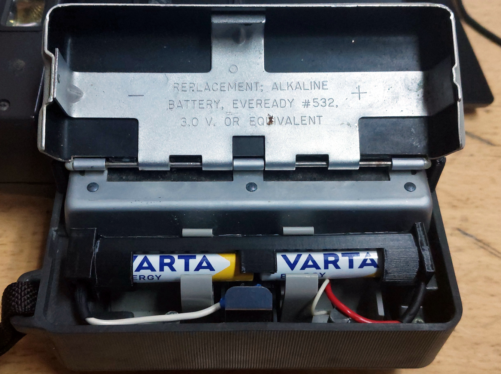
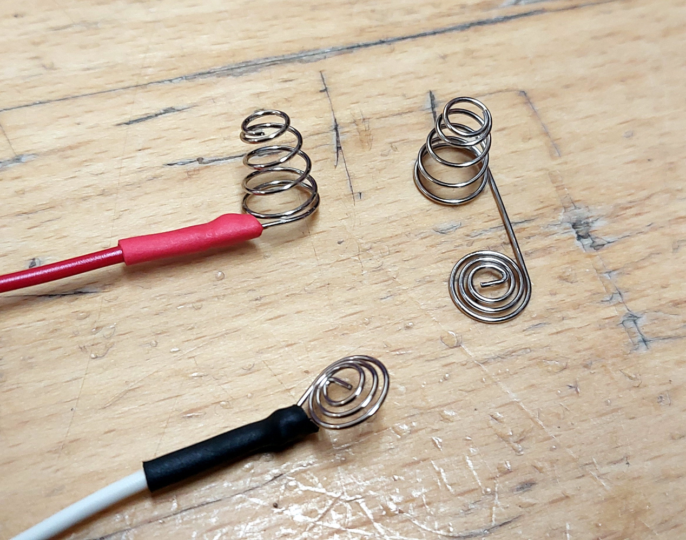

# AAA-for-532-battery-holder
A 3D printable battery holder designed to replace an Ever Ready 532 battery with 2 AAA cells in 1960s bellows Polatoid cameras

##Instructions
Print the model, either from the STL file or by rendering the OpenSCAD file. I printed mine on a Prusa Mini, with a brim and with supports on the bed.

I found some spring battery terminals designed for battery boxes on AliExpress. Mine were the coiled wire type, and were designed to connect the positive of one cell to the negative of the next. I cut one into two terminals and soldered the two to a pair of wires, as shown in the image below. The spring terminals should slide into the 3D printed receptacle, the wider one being for the negative spring. You may find a set of tweezers useful here. The clip style connectors in the camera were removed, and the wires from the battery holder soldered to their wires, observing polarity. I used heat shring sleeving for insulation on all connectors.

The resulting AAA battery holder should fit in the clip for the 532, and be short enough to fit within the battery compartment of the camera. This was tested in a Polaroid 104, and it should also work with other similar models.
